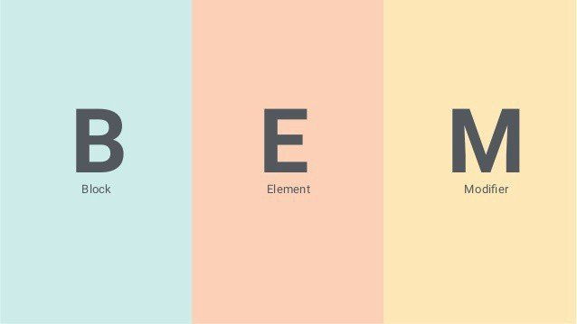

[Кликни, чтобы посмотреть моё резюме](https://drive.google.com/file/d/1jLRrlSM5L_6gdxSNBk17u5jsphLdoSTA/view?usp=drive_link)
[Кликни, чтобы посмотреть моё портфолио](https://aliakseisavelyey.github.io/)

# Алексей Савельев


---

## Контакты:

<div>
  <a href="https://www.linkedin.com/in/aliaksei-savelyey/">
    
  </a>
  
  <a href="https://www.codewars.com/users/AliakseiSavelyey">
    
  </a>
  <a href="https://github.com/AliakseiSavelyey">
    
  </a>
</div>

- Местонахождение: Минск, Беларусь
- Телефон: +375291410707
- Телеграм: https://t.me/Gidden
- Gmail: aliakseisavelyey@gmail.com

---

## Обо мне:

<p>Привет! <br/>
<span>
Как Frontend-разработчик, я всегда стремлюсь изучать и
внедрять новые технологии и подходы в разработке.Cоздаю веб-сайты, разрабатываю игры и мобильные приложения.
Ищу самые эффективные решения сложностей, возникших по мере создания проектов. Адаптируюсь к изменениям в динамичных рабочих условиях. Люблю работать в команде и быстро нахожу общий язык со всеми участниками проекта. Спокойно отношусь к конструктивной критике и использую её для улучшения своей работы.</span></p>

---

## Навыки :

<div>
  &nbsp;
  &nbsp;
  &nbsp;
  &nbsp;
  &nbsp;
  &nbsp;
  &nbsp;
  &nbsp;
  &nbsp;
  &nbsp;
  &nbsp;
  &nbsp;
</div>

---

## Пример кода:

```javascript
function stairsIn20(a) {
  return 20 * a.reduce((s, a) => s + a.reduce((s, n) => s + n, 0), 0);
}
```